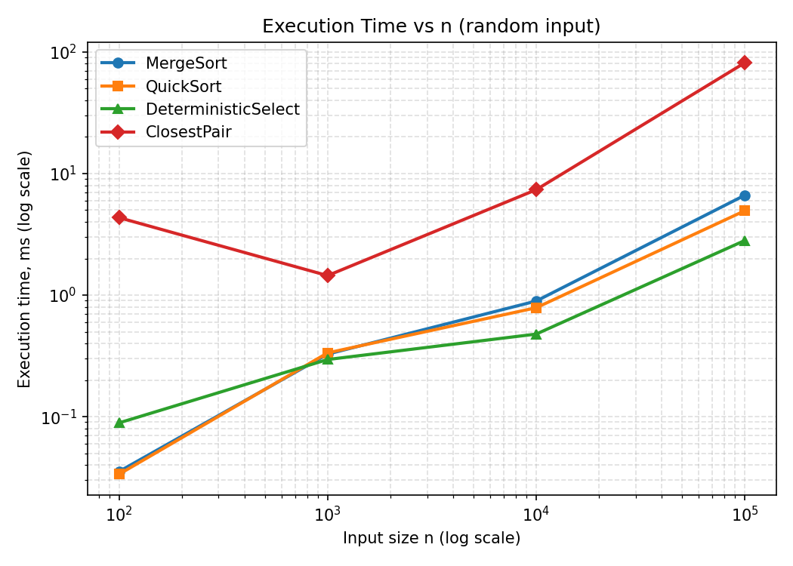
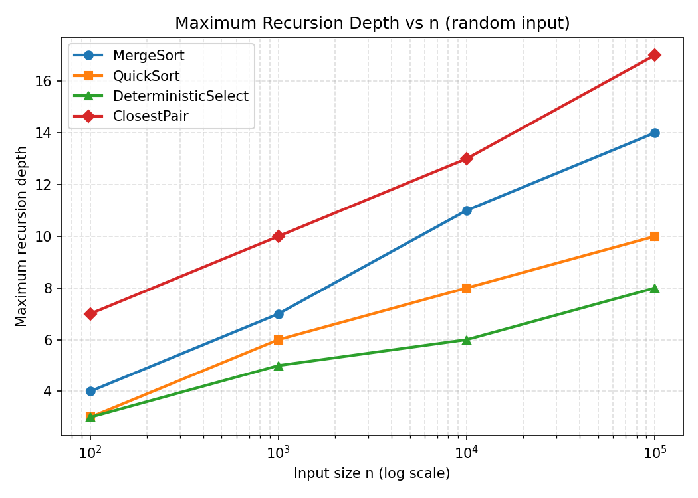
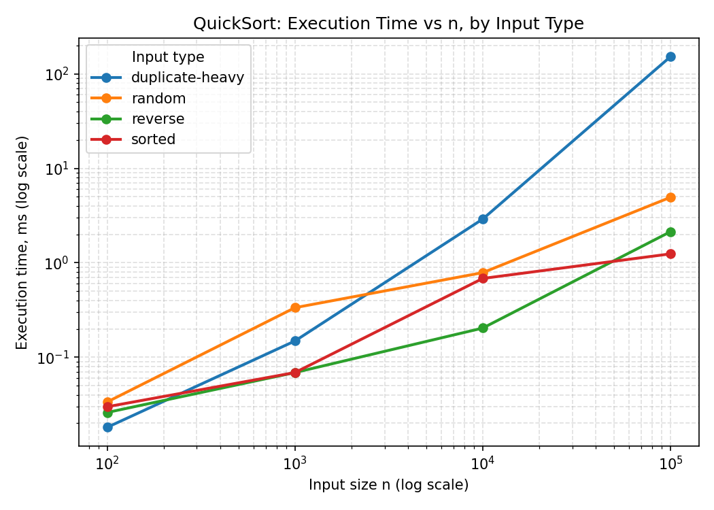

# DAA-Assignment-1

# Assignment 1: Divide-and-Conquer Algorithm Analysis

## A. Project Overview

**Purpose:** Analyze four divide-and-conquer algorithms — theoretical
complexity vs. measured execution time, recursion depth, and comparisons
across different input sizes and structures.

**Algorithms implemented:**
1. **MergeSort** — buffer-reusing sort, insertion-sort cutoff at n ≤ 16.
2. **QuickSort** — randomized, in-place, recurses on smaller partition only.
3. **Deterministic Select** — Median-of-Medians, guaranteed Θ(n).
4. **Closest Pair of Points** — Θ(n log n) geometric divide-and-conquer.

---

## B. Algorithm Analysis

### 1. MergeSort
Splits array in half, sorts each half, merges with a reusable buffer.
**Complexity:** Θ(n log n) all cases. Space: O(n) buffer, O(log n) stack.
**Recurrence:** `T(n) = 2T(n/2) + Θ(n)` → Master Theorem Case 2 → **Θ(n log n)**.

### 2. QuickSort
Random pivot, in-place partition, recurses only on the smaller side,
iterates the larger side.
**Complexity:** Θ(n log n) expected, **O(n²) worst case**. Space: O(log n) stack.
**Recurrence:** balanced `T(n) = 2T(n/2) + Θ(n)` → Θ(n log n). Degenerate
`T(n) = T(n-1) + Θ(n)` → **Θ(n²)**.

### 3. Deterministic Select (Median-of-Medians)
Groups of 5 → group medians → recursive median-of-medians as pivot →
3-way partition → recurse only into the needed part.
**Complexity: Θ(n) worst case.** Space: O(log n) stack.
**Recurrence:** `T(n) ≤ T(n/5) + T(7n/10) + Θ(n)`. Branch sizes sum to
9/10 < 1 (Akra–Bazzi) → **Θ(n)**.

### 4. Closest Pair of Points
Sort by x, split at median, recurse both halves, merge points by y
(like MergeSort's merge), scan a narrow strip for cross-half pairs.
**Complexity: Θ(n log n).** Space: O(n) per level.
**Recurrence:** `T(n) = 2T(n/2) + Θ(n)` → **Θ(n log n)** (brute force: Θ(n²)).

---

## C. Experimental Results

Measured with `System.nanoTime()`. Sizes: 100 / 1,000 / 10,000 / 100,000.
Types: random, sorted, reverse, duplicate-heavy. Full data:
`results/results.csv`.

### Execution time (ms)

| Algorithm | Type | n=100 | n=1,000 | n=10,000 | n=100,000 |
|---|---|--:|--:|--:|--:|
| MergeSort | Random | 0.035 | 0.327 | 0.893 | 6.621 |
| MergeSort | Sorted | 0.019 | 0.261 | 0.515 | 2.410 |
| MergeSort | Reverse | 0.026 | 0.049 | 1.606 | 3.379 |
| MergeSort | Duplicate | 0.024 | 0.047 | 0.435 | 4.000 |
| QuickSort | Random | 0.034 | 0.335 | 0.786 | 4.936 |
| QuickSort | Sorted | 0.030 | 0.069 | 0.682 | 1.243 |
| QuickSort | Reverse | 0.026 | 0.069 | 0.204 | 2.135 |
| QuickSort | Duplicate | 0.018 | 0.149 | 2.903 | **152.327** |
| Select | Random | 0.089 | 0.295 | 0.478 | 2.809 |
| Select | Sorted | 0.024 | 0.170 | 1.313 | 2.579 |
| Select | Reverse | 0.031 | 0.177 | 1.875 | 1.826 |
| Select | Duplicate | 0.016 | 0.049 | 0.137 | 1.245 |
| ClosestPair | Random | 4.333 | 1.446 | 7.354 | 81.316 |
| ClosestPair | Sorted | 0.206 | 0.246 | 2.849 | 10.786 |
| ClosestPair | Reverse | 0.327 | 0.229 | 2.494 | 6.289 |
| ClosestPair | Duplicate | 0.250 | 0.631 | 5.758 | 55.869 |

### Max recursion depth

| Algorithm | Type | n=100 | n=1,000 | n=10,000 | n=100,000 |
|---|---|--:|--:|--:|--:|
| MergeSort | any | 4 | 7 | 11 | 14 |
| QuickSort | Random/Sorted/Reverse | 3 | 5–6 | 7–8 | 10–11 |
| QuickSort | **Duplicate** | 3 | 4 | **3** | **3** |
| Select | any | 3 | 5 | 6 | 8 |
| ClosestPair | any | 7 | 10 | 13 | 17 |

QuickSort's depth stays low on duplicate-heavy input even though that's
its *slowest* case — depth and total work are different things.

### Plots

---

## D. Discussion

**Match theory?** Mostly yes — MergeSort, QuickSort (non-adversarial),
ClosestPair follow Θ(n log n); Select follows Θ(n). Main exception:
QuickSort on duplicate-heavy data, which triggers its known worst case.

**Input structure effect?** Mainly hits QuickSort: duplicate-heavy at
n=100,000 → 152ms, ~500M comparisons (30–120× slower), because two-way
partitioning puts almost all pivot-equal elements on one side. Select
gets *faster* on duplicates (3-way partition skips them).

**Why smaller-first recursion helps QuickSort:** bounds recursion
**depth** at O(log n) (proven: depth ≤ 4 even on duplicate-heavy input).
Doesn't fix worst-case **time** — shallow depth still allowed ~500M
comparisons.

**Why Median-of-Medians guarantees O(n):** pivot always discards ≥~30%
of elements; branch sizes (n/5 + 7n/10 = 9n/10) sum to less than n, so
total work across levels is a convergent series → Θ(n).

**Why Closest Pair beats O(n²):** brute force checks ~n²/2 pairs. D&C
solves each half then checks only a narrow strip near the split — a
packing argument caps strip comparisons per point at a constant, giving
O(n) strip work per level → Θ(n log n) total.

**Practical factors:** ClosestPair took 4.3ms at n=100 but 1.4ms at
n=1,000 — JVM/JIT warm-up on the first run. Also: MergeSort's buffer
allocation vs. QuickSort's in-place work, GC pauses, and cache locality
(array access vs. object references) affect same-complexity algorithms
differently. A single `nanoTime()` run shows trends, not precise
benchmarks.

---

## E. Reflection

The Median-of-Medians implementation taught me the most: my first
version used a two-way partition and hung on duplicate-heavy input at
n≈60,000, because with few distinct values the pivot kept landing on
the same side each round, shrinking the range by one element instead of
a constant fraction — silently breaking the Θ(n) guarantee. A 3-way
partition fixed it.

Closest Pair was the other challenge — keeping points sorted by y
across recursion without re-sorting at every level. The clean fix was
having each recursive call return its points already y-sorted, merged
the same way MergeSort merges numbers, instead of a more complex
identity-tracking structure I tried first.
